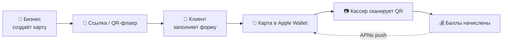

<div align="center">


# Amio

**Цифровые карты лояльности для Apple Wallet — без приложений и сложной интеграции**

Купоны, абонементы и накопительные баллы прямо в кошельке клиента.


</div>

---

> [!NOTE]
> Проект в архиве и больше не развивается. Код открыт в ознакомительных целях.

## ✨ Возможности

| | |
|---|---|
| 🎨 **Конструктор карт** | Логотип, обложка, цвета, процент кэшбэка — превью карты в реальном времени |
| 📲 **Apple Wallet** | Генерация подписанных `.pkpass` и автообновление карты на телефоне клиента |
| 🔗 **Самостоятельная регистрация** | Публичная ссылка `/join/:slug` и QR-флаер — клиент сам получает карту за 10 секунд |
| 📷 **POS-сканер** | Сканирование QR с камеры, начисление и списание баллов |
| 🔔 **Push-рассылки** | Маркетинговые уведомления через APNs прямо на карту в Wallet |
| 📊 **Аналитика** | Клиенты, сканирования, обязательства по баллам, активность за неделю |
| 💳 **Подписки** | Пробный период и ручная активация аккаунтов бизнеса |

## 🧭 Как это работает



## 🏗 Архитектура

```
amian/
├── frontend/            # React + Vite SPA (дашборд, сканер, лендинг)
│   └── src/
│       ├── pages/       # Home, Dashboard, Scanner, Settings, Join...
│       ├── components/  # BrandLayout, Analytics, ScanLogs...
│       └── context/     # AuthContext (Supabase Auth)
├── api/                 # Serverless-функции Vercel
│   ├── passes/          # Генерация .pkpass
│   ├── passkit/v1/      # Apple PassKit Web Service
│   ├── notifications/   # Push-рассылки
│   ├── analytics/       # Статистика для дашборда
│   ├── public/          # Брендинг и регистрация по ссылке
│   └── transaction.js   # Транзакции POS-терминала
├── lib/apn.js           # Провайдер Apple Push Notifications
├── backend/pass-assets/ # Иконки для pass
└── migrations/          # SQL-миграции Supabase
```

## 🚀 Запуск

```bash
git clone https://github.com/nolimitima/amian.git
cd amian/frontend
npm install
npm run dev
```

Создайте `frontend/.env.local`:

```env
VITE_SUPABASE_URL=https://your-project.supabase.co
VITE_SUPABASE_ANON_KEY=your-anon-key
```

<details>
<summary><b>Переменные окружения для API (Vercel)</b></summary>

| Переменная | Описание |
|---|---|
| `SUPABASE_URL` | URL проекта Supabase |
| `SUPABASE_SERVICE_ROLE` | Service role ключ |
| `PASS_TYPE_IDENTIFIER` | Pass Type ID, например `pass.com.example` |
| `TEAM_IDENTIFIER` | Apple Team ID |
| `PASS_P12_BASE64` | Сертификат pass в base64 |
| `PASS_P12_PASSWORD` | Пароль от сертификата |
| `WWDR_CERT_BASE64` | Сертификат Apple WWDR |
| `PUBLIC_BASE_URL` | Публичный адрес приложения |

Подробнее — в [PASSKIT_SETUP.md](PASSKIT_SETUP.md) и [SUPABASE_SETUP.md](SUPABASE_SETUP.md).

</details>

## 👤 Автор

**[@nolimitima](https://github.com/nolimitima)**

---

<div align="center">
<sub>Сделано в Казахстане 🇰🇿</sub>
</div>
